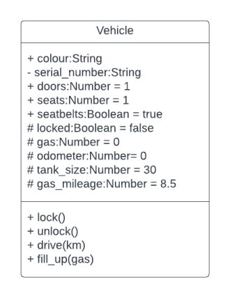

# Your Task (2.7 - Protection)

###### ICS4U - Mr. Brash 🐿️

  - 🔙 [To the lesson](README.md)

## A Vehicle 🚘

Now it's your turn to try creating a class with some private or protected members. You will need to decide which members require `#` and when to create a `get` and/or `set` to manipulate protected members.

> `Important Note:` The task is detailed. Read it carefully and try not to deviate from it. While independent learning is important in this course, so is knowing when to ask for assistance. Talk to each other, utilize the Internet, and ask your teacher for clarification and help.

### The Vehicle Class
You are going to define a `Vehicle` that fits the diagram and description below:

Notice the `+`, `-`, and `#`? That means **public**, **private**, and **protected**, respectively.

### The `Vehicle` class has the following PUBLIC members:
- `colour` (a String)
- `doors` (a Number representing the number of doors; defaults to 1)
- `seats` (a Number representing the number of seats; defaults to 1)
- `seatbelts` (a Boolean if this vehicle has seatbelts or not)

### It has the following PROTECTED members:
- `locked` Read-only (a Boolean representing if the vehicle is locked)
- `gas` Read-only (a Number representing the amount of gas left in the vehicle to the nearest hundredth)
- `odometer` Read-only (a Number representing the number of Km driven)
- `tank_size` Read-only (a Number representing the maximum L of gas)
- `gas_mileage` Read-only (a Number in L/100Km representing the efficiency of the vehicle)

### It has the following PRIVATE member:
- `serial_number` (a String that is the registered serial number of the vehicle)

### The public methods are described as follows:
- The `constructor` will set the colour, serial number, doors, seats, seatbelts, tank_size, and gas_mileage. The gas and odometer will default to zero.
  - gas_mileage is a value in L/100km. For example, a typical vehicle might use 9.5L/100km so the gas_mileage would be 9.5
- `lock()` - Set the status of the vehicle to _locked_
- `unlock()` - Set the status of the vehicle to _unlocked_
- `drive(km)` - Based on the `gas_mileage` of the vehicle (in L/100Km) drive the number of Km given - _if there is enough gas_. Add the mileage to the odometer and subtract the appropriate amount of gasoline from the tank (**_both_ rounded to the nearest hundredth**). 
  - If there is not enough gas for the full trip, drive until the tank is empty, adjusting the odometer and gas level appropriately (**_both_ rounded to the nearest hundredth**).
  - No matter what, _return_ the new value on the odometer. If you go nowhere (already out of gas), still return the value on the odometer. 
  - `km` will always be a value >= 0.
- `fill_up(gas)` - Add the amount of `gas` to the tank, without overfilling. `gas` will always be a positive number.

This last one is _not_ in the Class diagram. The engineers added it last-minute.
- Create a "getter" called `range`
  - Based on the `gas_mileage` and the amount of `gas` left in the tank, `range` will provide the amount of Km we can drive before we will run out of gas, rounded to the nearest whole Km.

You might need to think about the `.drive(km)` and `range` methods. For example, Mr. Brash's Mazda 3 currently has an average gas mileage of 6.8 L/100Km. That means he'll use 0.068 L per Km. If he were to drive 50 Km, he'll use approximately 50 * 0.068 = 3.4 L of gasoline.

Make sure that you test your class thoroughly. Feel free to ask for assistance, if necessary!

   
🐿️
