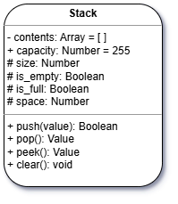

# 13 - Protection Practice (Finalize the Stack Class)

###### ICS4U - Mr. Brash 🐿️

##### 🔙 [To the lesson](README.md)

---

Hopefully you have a working definition of a `Stack`. If you are behind or need assistance, please see your teacher for extra help!

---

#### The Problem:

We can see or manipulate the `contents` and `capacity`:

```JS
let sample = new Stack([5, 12, 7]);

console.log(sample.contents);   // [5, 12, 7]  - we shouldn't be able to see that
sample.contents[7] = "Sucker";  // Well that would be bad
sample.contents = new Array();  // Uh oh...
sample.capacity = -55;          // We're in trouble
```

> 🤔 Isn't the purpose of a Stack to only see the top item? 

⚠ The `.contents` of the `Stack` class should be _hidden_ (private). We shouldn't be able to access it.

Your job, now that you know about _Protection_ and _getters_/_setters_, is to finalize your `Stack` class.



1. Copy over your definition of the `Stack` class from lesson 12.
2. Modify the `Stack` class so that it _hides_ the `.contents` protects (validates) the `.capacity`. To do this, you will use the `#` operator.
3. You will need to go through every function that utilizes or changes either of those members and include the `#` operator.
4. Add a _getter_ that allows us to see the `capacity`.
5. Add a _setter_ that allows us to modify the `capacity` with certain limitations:
    1. The new capacity must be a positive whole number > 0.
        1. We can ensure a whole number by using `Math.round()`
    2. It cannot go below the current length of `Stack.#contents`
6. Notice that `size`, `is_empty`, `is_full`, and `space` are listed as protected? That's because they are more like _properties_ instead of _functions_. You will need to create _setters_ for these, rather than the functions (methods) they were before.

Using this _new_ definition, we should be _unable_ to see the `.contents` array. Test it:

```JS
// A stack with 2 items and a max of 3
let my_stack = new Stack([9, 2], 3);  

my_stack.contents;   // undefined!

my_stack.is_full();  // false
my_stack.push("Pizza");
my_stack.push("Hello");
my_stack.peek();     // "Pizza"
my_stack.is_full();  // true
```

Some more test code:
```JS
let plates = new Stack([5, 3, 1], 5);

// Try to reduce the capacity below 3
plates.max_size = 1;   // Nothing should happen
console.log(plates.max_size);       // 5

// Change it to 3
plates.max_size = 3;   // No problem!
plates.is_full();      // true

// Try a decimal number or String or negative number...
```

Hopefully you did it! A fully functional `Stack` object. High five!   👋 🙌 👋
  
Keep this code safe - you're going to need it later.

---

### Finished early?

  - Take a look at some [coding challenges](https://edabit.com/challenges) or maybe a [capture the flag (CTF)](https://cryptohack.org/) hacking challenge.
  - Prefer a [gamified coding challenge](https://www.codingame.com/start/)?
  - Or maybe you want to [learn more about coding on your own](https://exercism.org/)?

---

<br>
🐿️
