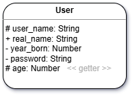

# 13 - Protection (Lesson)

###### ICS4U - Mr. Brash 🐿️

Protecting members of a class and using Getters or Setters to access private or protected members.

#### 😃 Strap in - this is a good one!

  - [Part 1: Protection](#part-1---protection)
  - [Part 2: Gets and Sets](#part-2---gets-and-sets)
  - [Jump to the Practice (Classwork)](./PRACTICE.md)

## Part 1 - Protection

With normal variables, we have no way of _hiding_ the value. Objects, however, have the ability to make items unavailable.

👉 Any _member_ of an object can be **`+ public`** (default), **`- private`** (hidden), or **`# protected`** (read-only).

For example, the `contents` of the `Stack` class should be hidden (_private_) and the `capacity` of the `Stack` should be read-only (_protected_). **More on the `Stack` later**.

### Example: `User`

Let's make a simple object to represent a user of an app or website:  


Simple enough - we have 5 members and no functions:

```JS
class User {
  // Private and/or protected
  #user_name = "";
  #year_born = 1900;
  #password = "";

  // Public
  real_name = "";

  // Age is special - more on that later
}
```

Look at the syntax - any member that is not public is declared with an [octothorpe](https://www.merriam-webster.com/dictionary/octothorpe) (#). **This makes them _private_**.

Try declaring a new `User` and change the `real_name` and then try to change the `#user_name`.

Let's add a `constructor`:
```JS
class User {
  ...
  constructor(uname, pwd, real_name, yr_born) {
    this.#user_name = uname;
    this.#password = pwd;
    this.real_name = real_name;
    this.#year_born = yr_born;
  }
}
```

The `constructor` is permitted to change the private members. Notice the syntax with the [octothorpe](https://www.merriam-webster.com/dictionary/octothorpe) (#).

This means we can _**set**_ values at instantiation but can't see or modify them afterwards.

```JS
let myuser = new User("mister5qu1rrel", "password123!", "Mr. Squirrel", 2007);

console.log(myuser.#password);   // Not permitted
myuser.#user_name = "New_Name";  // Not permitted
```


## Part 2 - Gets and Sets

We need to be able to _see_ or _get_ the `#user_name` but not change it. Similarly, we need to be able to get the `#age` but it shouldn't look like a function.

In **OOP** we can modify the protection of a member with special methods called _getters_ and _setters_. Let's create a _getter_ for the `#user_name` so that it is read-only (protected) instead of private and another one for `age`.

```JS
class User {
  
  ...

  get user_name() { 
    return this.#user_name; 
  }

  get age() {
    const year = new Date().getFullYear();
    return year - this.#year_born;
  }

}
```

What is interesting is how you _call_ those methods - they are _not_ functions. They are _protected members_:
```JS
let myuser = new User("mister5qu1rrel", "password123!", "Mr. Squirrel", 2007);

console.log(myuser.user_name);   // mister5qu1rrel
console.log(myuser.age);         // 18

myuser.user_name = "new_user_name";  // Not permitted!
```

⚠️ Getters look and act like _members_ (properties).

#### 🤔 What about changing the password?

As the name implies, there is also a way to _set_ the value of a protected member but not see it. These are called _setters_. They are also useful for checking the validity of a value, like making sure `year_born` isn't changed to a String, a negative number, or the current year.

```JS
class User {

  ...

  // Verify a new password is valid
  set password(new_password) {
    // Make sure the password is long enough (could also check other rules)
    if (new_password.length >= 8) {
      this.#password = new_password;
      return true;
    }
    return false;
  }

  // Verify a change in year_born is valid
  set year_born(new_year) {
    if (isNaN(new_year) || new_year <= 1900 || new_year > new Date().getFullYear())
      return -1;

    this.#year_born = new_year;
  }

  // There's no reason to hide year_born, so let's add a getter
  get year_born() { return this.#year_born; }
}
```

We now have a sensible way of changing the password or year_born but the password remains secure!

### To Recap

- Class diagrams can show public (+), protected (#), and private (-) members
- It is up to the programmer to know if a read-only (protected) member is actually a _getter_, like the `age` member above
- In JavaScript we protect members with the Octothorpe (#) to make them private
- We can modify private members from _inside_ the class declaration but **not** after instantiation (remember to include the #)
- By providing a _getter_ with `get`, we allow a private member to be seen (become protected) or a fake member to be created
- By providing a _setter_ with `set`, we can validate the new value before any adjustments are made


[Let's apply this new knowledge to our Stack class. Click to see your task!](./PRACTICE.md)


<br>

🐿️

